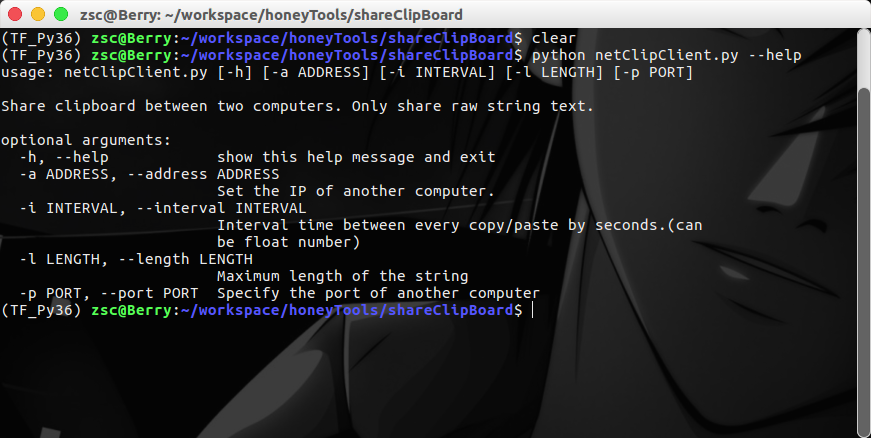

# Share Clipboard Between 2 Computers

> This project is designed to share the content of clipboard between 2 computers located in the same  network. The server script is only designed for **Linux and Mac**, and the client script is designed for **Linux, Mac and Windows**.
>
> But now, this project only support raw string data in clipboard. And the string can't be too long. I will add more options in the future.

## Prepare

First, you need to configure a python 3 environment.

| Environment |    netClipClient.py     |    netClipServer.py     |
| :---------: | :---------------------: | :---------------------: |
|   Windows   |        clipboard        |            \            |
|    Linux    | xclip, PyQt5, clipboard | xclip, PyQt5, clipboard |
|     Mac     |        clipboard        |    xclip, clipboard     |
|             |                         |                         |

Run the following commands to prepare the environment for **both server side and client side of Linux system**:

```shell
sudo apt-get install xclip
sudo pip3 install PyQt5==5.8.0
sudo pip3 install clipboard
```

Use "pip3 install clipboard" to install clipboard for **Windows and Mac client side**.

Use brew to install xclip for **Mac server side**.

## How to use?

You can use the following command to get the usage message:

```shell
python3 netClipClient.py --help
```



### Start the Server Side

You must start the server side before starting the client side, use "-p" to specify which port is used to listen the connection:

```
python3 netClipServer.py -p 16068
```

### Start the Client Side

You should specify the server IP address and server port when you start your  client:

```shell
python3 netClipClient.py -p 16068 -a 10.193.0.11
```

## Happy Use!

Now when you copy a string on one computer, you can directly paste it on another computer!

